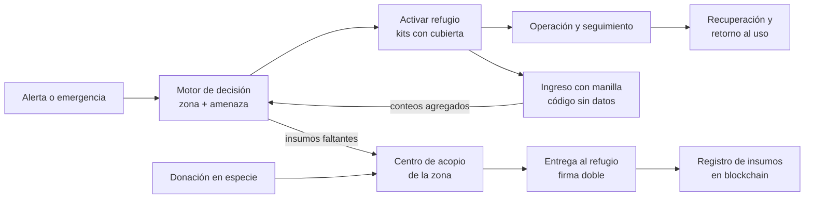

# Cali Activa – Red de Espacios Refugio (RETO-01)

25 de septiembre de 2026 · Herlin Echeverry

## Resumen ejecutivo

Cali Activa es una red de espacios públicos pre-designados que se preparan antes de la emergencia, se transforman durante ella y vuelven a su uso cotidiano con un kit estándar reutilizable. Responde a la pregunta retadora del RETO-01: activar y operar funciones temporales de forma segura y coordinada según el tipo de emergencia, y facilitar el retorno del espacio.

La propuesta tiene tres piezas: un **Kit Cali Activa** dimensionado por cada 20 personas (agua, refugio, energía, cubierta), una **red de espacios con roles distintos según la emergencia** y un **motor de decisión** que calcula brechas, kits necesarios y entidades responsables con criterios explicables.

El ciclo sigue las cuatro fases que exige el reto: preparación, activación, operación con seguimiento y recuperación.

## Problema y alcance

En el sismo del 10 de agosto de 2026, los espacios se habilitaron sobre la marcha. En la Cancha de Hockey se alojaron más de 30 familias y 143 personas, con faltantes de baños y sin caracterización de la población. La Defensoría del Pueblo pidió mejorar la organización de albergues, articular con el ICBF la protección de niñas, niños y adolescentes, y adecuar los servicios sanitarios (fuente: ficha del RETO-01).

La causa de fondo es que la decisión sobre qué espacio usar, para qué y con qué condiciones depende de información dispersa y de evaluaciones hechas en plena emergencia.

**Qué cubre la propuesta:**

- Caracterización y pre-designación de espacios antes de la emergencia.
- Decisión diferenciada por tipo de emergencia (sismo, inundación, deslizamiento, incendio forestal).
- Cálculo de brechas y de kits necesarios según la población.
- Asignación de cada brecha a la entidad responsable.
- Seguimiento de variables críticas y retorno al uso cotidiano.

**Qué no cubre:**

- Evaluaciones estructurales ni conceptos técnicos de seguridad: los emite la autoridad competente y el sistema solo los exige.
- Obras civiles hidráulicas (canales, embalses, cisternas subterráneas).
- Identificación individual de personas en registros públicos ni reconocimiento facial.

## Principios de diseño

Toda pieza debe ser reutilizable, sostenible, barata, fácil de mantener y fácil de implementar. Lo que no pasa este filtro sale de la propuesta.

| Componente evaluado | Decisión | Razón |
| --- | --- | --- |
| Cancha rebajada como vaso de retención | Descartado | Obra civil, licencias, costo alto |
| Cisterna subterránea | Descartado | Costo, limpieza difícil, riesgo de criaderos de mosquitos |
| Captación de lluvia en techo con tanques modulares | Incluido | Sin obra civil, se instala en un día, ampliable y trasladable |
| Jardines de lluvia en bordes del espacio | Incluido | Baratos, los mantiene el personal de parques |
| Particiones de tubo PVC y tela lavable | Incluido | Material de ferretería local, reutilizable por años, sin herramientas |
| Módulo cerrado tipo Better Shelter | Solo funciones especiales | Costo alto por unidad; se reserva para espacio NNA y punto de salud |
| Kit solar portátil por espacio | Incluido | Compartido, no uno por módulo; útil en tiempo normal |
| Software de gestión en celular, sin conexión | Incluido | Costo mínimo, sin infraestructura pesada |

La **estandarización** es lo que abarata el sistema: mismas piezas en todos los espacios, compra en volumen, una sola capacitación y kits que se mueven entre espacios.

## Componentes

La unidad de implementación es el **Kit Cali Activa para 20 personas**. Un espacio que recibe 143 personas necesita 8 kits (143 ÷ 20, redondeado hacia arriba).

### Contenido del kit (por 20 personas)

| Capa | Contenido | Referencia de dimensionamiento | Uso cotidiano |
| --- | --- | --- | --- |
| Saneamiento | 1 baño portátil | 1 baño por cada 20 personas (Esfera, verificar edición vigente) | Eventos en el espacio |
| Agua | Capacidad para 300 L/día de uso no potable | 15 L/persona/día (Esfera, verificar) | Riego y aseo del escenario |
| Refugio | Particiones de tubo PVC y tela, unidades de 2 × 2 m | Área cubierta de referencia: 70 m² (3,5 m²/persona, verificar) | Stands de ferias y eventos |
| Cubierta | Cubierta modular desmontable para los 70 m² del kit | Medidas, material y anclaje por definir y cotizar | Toldo para eventos al aire libre |
| Energía | Parte proporcional del kit solar del espacio | Por cotizar | Iluminación del espacio |

Además, cada espacio designado como albergue tiene de 2 a 3 **módulos cerrados** para funciones que exigen paredes y puerta: espacio de protección NNA y punto de salud.

**Cubierta modular (decisión del equipo).** Cada kit incluye una cubierta desmontable que protege sus 70 m² de lluvia y sol, para poder armarlo también en espacios abiertos como canchas y campos. En espacios cubiertos la cubierta se guarda y no se usa.

### Agua

Tanques plásticos modulares conectados a las canales del techo del escenario. El volumen captado se estima así:

```
V (m³) = A (m²) × P (m) × C
```

Donde A es el área de techo, P la lluvia y C el coeficiente de escorrentía. Ejemplo hipotético: 1.000 m² de techo con un aguacero de 50 mm y C ≈ 0,8 captan unos 40 m³. El agua es **no potable**; consumo humano solo con tratamiento y aval de Salud Pública. Los jardines de lluvia en los bordes infiltran escorrentía y mitigan encharcamientos locales.

### Red de espacios con roles por emergencia

| Tipo de espacio | Rol en sismo | Rol en inundación |
| --- | --- | --- |
| Coliseo o escenario cubierto | Albergue, solo con concepto estructural APTO | Albergue, si no está en zona inundable |
| Cancha abierta con jardines de lluvia | Zona de encuentro y kits con cubierta | Retención de agua; no se usa como albergue |
| Institución educativa | Albergue o aula temporal | Albergue, si no está en zona inundable |
| Parque o plazoleta | Centro de acopio y distribución | Centro de acopio, si está en zona segura |

### Motor de decisión

Software de reglas que funciona en celular y sin conexión. Toma el espacio, el tipo de emergencia y la población en conteos agregados, y devuelve brechas, kits necesarios, entidad responsable y el criterio que generó cada recomendación. Las reglas se editan en un archivo de configuración sin reprogramar.

## Fase 1 – Preparación

En tiempo normal, cada espacio se caracteriza, obtiene su concepto estructural y queda pre-designado con un rol por tipo de emergencia. Así, ninguna evaluación básica se hace en plena emergencia.

1. **Caracterización.** Se registran atributos medibles del espacio: área cubierta, baños, agua disponible, energía, accesibilidad, conectividad, zona inundable y ubicación.
2. **Concepto estructural previo.** La autoridad competente emite el concepto (APTO / NO APTO) antes de cualquier emergencia. El sistema lo registra; nunca lo calcula.
3. **Pre-designación.** Según sus atributos, se asigna al espacio un rol para cada tipo de amenaza (ver tabla de la red de espacios).
4. **Capacidad en kits.** El motor calcula cuántos kits de 20 personas admite el espacio y qué brechas tiene hoy.
5. **Anticipación estacional.** Antes de cada temporada de lluvias, el pronóstico del IDEAM dispara una revisión: tanques limpios, jardines de lluvia sin obstrucción, kits completos y roles vigentes.
6. **Uso cotidiano y simulacro.** Los kits se usan en ferias, eventos y actividades del espacio. Armarlos con regularidad mantiene al personal entrenado y detecta piezas dañadas.

**Salida de la fase:** espacio en estado *Preparado*, con brechas identificadas y asignadas a su entidad responsable.

## Fase 2 – Activación

Al ocurrir la emergencia, el sistema propone qué espacios activar, con qué función y cuántos kits, según el tipo de evento y la población. La decisión final es de la Secretaría de Gestión del Riesgo.

1. **Registro del evento.** Tipo de emergencia y zona afectada.
2. **Filtro de espacios.** Se descartan los que tienen bloqueantes: concepto estructural NO APTO o pendiente en un sismo; zona inundable en una inundación.
3. **Estimación de población.** Conteos agregados: total, menores, adultos mayores y personas con discapacidad. Sin datos individuales.
4. **Cálculo de kits y brechas.** El motor calcula los kits necesarios y las brechas contra el estado actual del espacio. Ejemplo: 143 personas → 8 kits, 8 baños, 2.145 L/día de agua no potable.
5. **Propuesta explicable.** Cada recomendación muestra la regla que la generó.
6. **Activación de entidades.** Cada brecha se envía a su entidad responsable (ver matriz). Con menores presentes se activa la ruta NNA; con adultos mayores, Salud Pública.
7. **Traslado y montaje.** Los kits salen del espacio o de otros espacios de la red y se arman sin herramientas especiales.

**Regla de transición:** el espacio solo pasa a *Activado* si su concepto estructural es APTO y no tiene brechas bloqueantes (saneamiento, agua y accesibilidad cuando hay personas con discapacidad).

## Fase 3 – Operación y seguimiento

Durante la operación se vigilan pocas variables críticas y el motor recalcula brechas cada vez que cambia la población o el estado del espacio.

| Variable crítica | Cómo se registra | Alerta cuando |
| --- | --- | --- |
| Ocupación vs. capacidad | Conteo diario agregado | Ocupación supera la capacidad calculada en kits |
| Baños por persona | Conteo de baños operativos | Menos de 1 baño por cada 20 personas |
| Agua disponible | Nivel de tanques y entregas | Menos de un día de reserva |
| Composición de la población | Conteos por ciclo vital | Aparecen menores, adultos mayores o personas con discapacidad sin ruta activada |
| Energía | Estado del kit solar | Sin iluminación nocturna |
| Incidencias | Reporte del coordinador del espacio | Cualquier incidencia de seguridad o salud |

El registro lo hace el coordinador del espacio desde el celular, sin conexión si es necesario; los datos se sincronizan al recuperar señal. Cada alerta queda asignada a su entidad responsable y su cierre se registra: esa es la trazabilidad necesidad → servicio → entidad que pide el reto.

## Fase 4 – Recuperación y retorno

Cuando la población sale del espacio, los kits se desmontan, se revisan y vuelven a inventario, y el espacio recupera su uso cotidiano con un registro de lo aprendido.

1. **Desactivación.** La Secretaría de Gestión del Riesgo ordena el cierre de la función temporal. El espacio pasa a *En desactivación*.
2. **Desmontaje y revisión.** Los kits se desarman y se inventarían. Las piezas dañadas se reemplazan con material de ferretería local.
3. **Limpieza y verificación.** Se limpian tanques, baños y áreas. Se verifica que el espacio quede en condiciones para su uso habitual.
4. **Retorno.** El espacio pasa a *Recuperado* y vuelve a *Inventariado*, listo para una nueva preparación.
5. **Aprendizaje.** Se registran las brechas que aparecieron, el tiempo de activación y las alertas. Con eso se ajustan las reglas y el contenido del kit.

Ciclo de estados: Inventariado → Evaluado → Preparado → Activado → En operación → En desactivación → Recuperado → Inventariado. El sistema no permite saltar estados.

## Matriz de entidades responsables

Propuesta del equipo construida con las entidades que lista la ficha del reto. Debe validarla la Secretaría de Gestión del Riesgo.

| Tipo de brecha o activación | Entidad responsable propuesta | ¿Bloquea la activación? |
| --- | --- | --- |
| Concepto estructural | Sec. Infraestructura | Sí (en sismo, también si está pendiente) |
| Riesgo territorial (zona inundable) | Sec. Gestión del Riesgo | Sí, en inundación |
| Saneamiento (baños) | UAESP | Sí, en albergue |
| Agua | EMCALI | Sí, en albergue y punto de salud |
| Energía | EMCALI | Sí, en punto de salud |
| Accesibilidad | Sec. Infraestructura | Sí, si hay personas con discapacidad |
| Conectividad | DATIC | No |
| Protección NNA | ICBF y Sec. Bienestar Social | No bloquea; activación obligatoria |
| Atención en salud | Sec. Salud Pública | No bloquea; activación obligatoria |
| Seguridad del albergue | Sec. Seguridad y Justicia | No bloquea; activación obligatoria |
| Área cubierta insuficiente | Sec. Gestión del Riesgo (reubicación) | No; reduce capacidad |
| Inventario y logística de kits | UAE de Gestión de Bienes y Servicios | No |

## Cumplimiento de requisitos técnicos mínimos

| Requisito del reto | Cómo se cumple |
| --- | --- |
| Considerar tipo de emergencia, territorio, función, capacidad, servicios, accesibilidad, seguridad y necesidades diferenciales | Atributos del espacio + tipo de emergencia + conteos por ciclo vital entran al motor de reglas |
| Identificar brechas entre el estado actual y el necesario | Motor de brechas por kit de 20 personas |
| Relacionar necesidades con entidades responsables | Matriz de entidades; cada brecha tiene responsable |
| Mostrar el cambio de estado en preparación, activación, operación y recuperación | Máquina de estados con transiciones validadas |
| No reemplazar evaluaciones estructurales ni decisiones de autoridad | El concepto estructural es un dato de entrada; la decisión final es de Gestión del Riesgo |
| Privacidad y minimización de datos personales | Registro nominal custodiado; lo público son solo conteos agregados |
| Sin reconocimiento facial ni identificación individual innecesaria | No se usa ninguna de las dos |
| Recomendaciones automatizadas comprensibles | Cada recomendación muestra la regla que la generó |
| Valor en la operación cotidiana (se valora especialmente) | Agua para riego, kits y cubiertas en ferias y eventos, iluminación solar |

## Indicadores de validación

Los seis indicadores sugeridos por la ficha se miden sobre un escenario simulado basado en la Cancha de Hockey (143 personas).

| Indicador del reto | Cómo se demuestra en el prototipo |
| --- | --- |
| Diferenciar la respuesta según el tipo de emergencia | El mismo espacio da resultados distintos según la amenaza |
| Número de variables de preparación consideradas | Conteo de atributos y reglas del motor |
| Identificar brechas del espacio | Lista de brechas con cantidades (baños faltantes, litros faltantes) |
| Trazabilidad necesidad → servicio → entidad | Cada brecha con entidad responsable y regla visible |
| Tiempo para generar una propuesta de activación | Medido en el escenario simulado, desde el registro del evento hasta la propuesta |
| Representar el ciclo desde preparación hasta recuperación | Recorrido completo de estados en la demo |

Indicador adicional propuesto: **costo por persona atendida** del kit, una vez cotizado.

## Prototipo para la hackathon (TRL 3)

- [ ] **Motor de decisión funcional** con cálculo por kits y fase de anticipación.
- [ ] **Escenario simulado:** Cancha de Hockey con 143 personas. Los atributos del espacio son ficticios salvo la población, y así se declara.
- [ ] **Maqueta 3D del sitio piloto** (ver `PROMPT_CODEX_3D.md`).
- [ ] **Protocolo operativo de una página por fase.**
- [ ] **Cotización del kit para 20 personas** en ferreterías de Cali.

## Mapa de refugios por zona (preliminar)

La red se distribuye por zonas con dos reglas: el refugio queda **cerca de la población afectada pero fuera de la zona de la amenaza**, y **la aptitud de cada espacio cambia con el tipo de amenaza**. Tras un sismo se usan primero los espacios abiertos (réplicas) y los cubiertos solo con concepto estructural.

| Zona | Amenaza principal | Fuente |
| --- | --- | --- |
| Oriente y norte (comunas 6, 7, 13, 14, 15, 21 y Navarro) | Inundación por ruptura del jarillón del río Cauca | [Alcaldía, simulacro nacional](https://www.cali.gov.co/gestiondelriesgo/publicaciones/118024/cali-hara-parte-del-v-simulacro-nacional-de-respuesta-a-emergencias/); [Alcaldía, Plan Jarillón](https://www.cali.gov.co/gestiondelriesgo/publicaciones/168204/cali-recibe-obras-de-reforzamiento-en-mas-de-11-kilometros-del-jarillon/) |
| Oriente (llanura aluvial) | Sismo con posible licuación del jarillón; riesgo para el agua de la ciudad | [Alcaldía, Plan Jarillón](https://www.cali.gov.co/gestiondelriesgo/publicaciones/167270/plan-jarillon-de-cali/) |
| Toda la ciudad | Sismo (amenaza alta, 0,25g en roca) | [Alcaldía, microzonificación](https://www.cali.gov.co/publicaciones/microzonificacion_sismica_cali_pub) |
| Ladera oeste (comunas 1, 18, 20; también 2 y 19) | Deslizamientos | [El País](https://www.elpais.com.co/cali/piden-mayor-control-a-construcciones-en-la-ladera-por-riesgo-de-derrumbes.html) |
| Ladera oeste (comunas 1, 18, 20, Pance, La Buitrera, El Saladito) | Incendios forestales | Bitácora del equipo (`docs/PROYECTO.md`) |

| Zona afectada | Amenaza | Refugio candidato | Razón |
| --- | --- | --- | --- |
| Oriente | Inundación | Coliseo María Isabel Urrutia (Mariano Ramos) | Cubierto, más lejos del río |
| Oriente | Sismo | Polideportivos Doce de Octubre y Sol de Oriente | Canchas abiertas cercanas |
| Norte (Calimio) | Inundación | Coliseo Calima; Polideportivo Brisas de los Andes | Cubiertos, más alejados del río |
| Norte | Sismo | Unidad Recreativa Calimio Norte | Abierta y cercana; descartada en inundación |
| Ladera oeste (comuna 1) | Incendio o deslizamiento | Coliseo Evangelista Mora (San Fernando) | En el plano, fuera de la interfaz con el cerro |
| Ladera oeste (comuna 1) | Sismo | Coliseo La Mutis (Terrón Colorado) | Cerca de su comunidad; nunca en incendio |
| Ladera suroeste (Siloé, comuna 18) | Incendio o deslizamiento | Polideportivo Los Fundadores (Pampalinda) | Zona plana cercana |
| Sur | Sismo | Parque del Ingenio; Polideportivo Valle del Lili | Espacios abiertos amplios |
| Centro-sur | Cualquiera | Complejo Jaime Aparicio (Cancha de Hockey, Diamante de Béisbol) | Albergues oficiales tras el sismo |

Los albergues oficiales del sismo quedaron concentrados en el complejo Jaime Aparicio, mientras que los albergues autogestionados aparecieron en el norte (Chiminangos y Calimio Norte). La red debe distribuirse por zonas, no concentrarse.

**Por verificar:** cada asignación contra los mapas de amenaza del POT en el geoportal IDESC. Prioridad: Sol de Oriente (cerca del río), Coliseo Calima y Brisas de los Andes (mancha de inundación) y Evangelista Mora (franja de incendios de la comuna 1).

## Sitio piloto: complejo Jaime Aparicio

> **Revisión de mediciones, 25/09/2026:** la tabla siguiente conserva el supuesto histórico de la maqueta. La Alcaldía identifica a Miguel Calero como coliseo de hockey en línea; 91,40 × 55 m no es una medida verificada del escenario. No utilizarla para deducir área disponible. Ver `maqueta3d/deliverables/mediciones/LEEME.md` para la discrepancia y la huella cartográfica candidata a voleibol.

Sitio piloto de la maqueta 3D, porque fue el albergue oficial del sismo del 10 de agosto de 2026 y reúne espacios abiertos y cubiertos. Las medidas son reglamentarias; las que dicen "medir" se toman sobre imagen satelital o en el geoportal IDESC.

| Escenario | Tipo | Medida | Fuente | Rol propuesto |
| --- | --- | --- | --- | --- |
| Cancha de Hockey Miguel Calero | Abierto | Campo 91,40 × 55,00 m (5.027 m²); con márgenes mínimos 97,40 × 59,00 m (≈ 5.747 m²) | [FIH, especificaciones de campo](https://www.fih.hockey/static-assets/pdf/fih-junior_world-cup-_events_field_specifications-16-01-05.pdf) | Zona de encuentro en sismo; alojamiento con kits con cubierta |
| Coliseo de Voleibol Francisco Chois | Cubierto | Por cancha: 18 × 9 m + zona libre mínima de 3 m = 24 × 15 m (360 m²); altura libre mínima 7 m. Número de canchas: medir | [Reglas de voleibol (FIVB)](https://faculty.kfupm.edu.sa/pe/abuhilal/volleyball_rules.html) | Alojamiento con particiones |
| Diamante de Béisbol | Abierto | Medir | — | Centro de acopio |
| Coliseo Evangelista Mora (San Fernando) | Cubierto | Medir | — | Refugio para población de ladera oeste |

**Posición relativa** (coordenadas de Google Maps; error de decenas de metros):

| Desde la Cancha de Hockey hacia | Distancia | Dirección |
| --- | --- | --- |
| Diamante de Béisbol | ≈ 180 m | Este (103°) |
| Coliseo de Voleibol Francisco Chois | ≈ 185 m | Noreste (53°) |
| Coliseo Evangelista Mora | ≈ 750 m | Norte-noroeste (345°) |

**Capacidad de referencia** (área ÷ 3,5 m² cubiertos por persona; bruta, sin descontar circulación ni servicios):

- Una cancha de voleibol con su zona libre (360 m²): hasta ≈ 102 personas brutas, o 5 kits.
- Caso real, 143 personas: 8 kits × 70 m² = 560 m². 5 kits en el coliseo y 3 kits con cubierta en el campo de hockey.

**Escalas sugeridas para la maqueta:** complejo a 1:500 (campo de hockey de 18,3 × 11 cm); detalle del coliseo a 1:50 (cancha con zona libre de 48 × 30 cm).

**Por medir antes de modelar:**

- [ ] Huella, altura libre y número de canchas del Coliseo Francisco Chois y del Evangelista Mora.
- [ ] Área de techo de cada coliseo (para la captación de agua).
- [ ] Baños existentes, accesos y rampas.
- [ ] Dimensiones reales del Diamante de Béisbol.
- [ ] Confirmar que el campo de hockey tiene las medidas reglamentarias.

## Registro de personas

Cada persona recibe al ingresar una **manilla con un código aleatorio** (QR o NFC) que no contiene ningún dato personal. El código solo sirve para enlazarla con el registro nominal, que custodia la entidad responsable (Bienestar Social o Gestión del Riesgo) con acceso restringido. Conviene conectarse al Registro Único de Damnificados de la UNGRD en lugar de crear uno paralelo (verificar cómo opera hoy).

| Dato | Dónde queda | Quién lo ve |
| --- | --- | --- |
| Código de la manilla | En la manilla | Cualquiera que la escanee; no revela nada por sí solo |
| Nombre, documento, condición, refugio y lugar dentro del refugio | Registro custodiado | Solo la entidad responsable |
| Conteos agregados por refugio y ciclo vital | Motor de decisión y tablero | Público; alimenta el cálculo de brechas |

Los datos de personas **nunca** van a la blockchain. Así se cumplen la prohibición de identificación individual innecesaria de la ficha y la Ley 1581 de 2012 (datos sensibles, protección reforzada de menores y derecho a suprimir datos).

## Centros de acopio por zona

Cada zona de la red tiene un centro de acopio, en un espacio distinto al refugio y fuera de la zona de amenaza. Todos comparten un solo inventario. Un solo centro para toda la ciudad sería un punto único de falla.

1. **Lista pública de necesidades.** Se publica lo que falta según las brechas del motor, para que no lleguen donaciones que nadie pidió.
2. **Recepción.** Se registra qué llega, cuánto y de quién (organización o donante anónimo).
3. **Clasificación.** Alimentos, agua, aseo, abrigo, kits. Lo vencido o inservible se descarta y se registra.
4. **Bodega e inventario común.** Cada zona ve el inventario de las demás para poder redistribuir.
5. **Despacho.** Salen los insumos hacia el refugio que los pidió.
6. **Entrega.** Firman quien entrega y quien recibe en el refugio.

## Trazabilidad de insumos en blockchain

Se registran en una cadena pública los movimientos de **insumos**: ingreso al centro de acopio, despacho y entrega en el refugio. Cualquiera puede verificar que un registro no se alteró. **No se registran personas ni dinero.**

| Evento | Qué se registra | Quién firma |
| --- | --- | --- |
| Ingreso | Tipo de insumo, cantidad, centro de acopio, fecha | Responsable del centro |
| Despacho | Tipo, cantidad, centro de origen, refugio de destino | Responsable del centro |
| Entrega | Tipo, cantidad, refugio | Quien entrega y quien recibe (firma doble) |

**Límites que se reconocen:**

- La cadena garantiza que el registro no se alteró, no que sea verdadero. La firma doble hace visible cualquier diferencia entre lo despachado y lo recibido.
- Complementa los registros oficiales (contabilidad e inventarios de la entidad); no los reemplaza.
- Para bajar costos, los movimientos del día se agrupan y se registra un solo resumen verificable (hash del lote) en una red de bajo costo.
- Firman personas y entidades responsables, no dispositivos. No se usa una DAO: la responsabilidad legal es de la Alcaldía.

**Alcance en la hackathon:** una pantalla simulada con el recorrido de un lote de insumos. La implementación real va al pitch como siguiente etapa.

## Salud y seguridad en la red

La ficha exige relacionar cada necesidad con la entidad responsable y prohíbe reemplazar decisiones de las autoridades competentes. La propuesta define **dónde** se ubica cada servicio y **a quién** activa el sistema, pero no diseña la operación médica ni la de la fuerza pública.

### Punto de salud (parte del kit)

- **Uno por cada refugio activado**, en uno de los módulos cerrados.
- **Ubicación:** junto al acceso y al punto de registro, en terreno plano y accesible, separado de los baños, con paso libre para ambulancias.
- **Qué hace:** primeros auxilios, valoración inicial, orientación y remisión. El apoyo psicosocial se coordina con Salud Pública y organismos como la Cruz Roja.
- **Qué no es:** no es un hospital. Los casos que requieren atención médica se remiten a la red hospitalaria, coordinada por el Centro Regulador de Urgencias (CRUE).
- **Quién lo opera:** lo define la Secretaría de Salud Pública. Un hospital de campaña, si esa entidad lo decide, queda fuera de esta propuesta; el motor solo puede proponerle un espacio.

### Roles por fase (propuesta del equipo, por validar)

| Actor | Preparación | Activación | Operación | Recuperación |
| --- | --- | --- | --- | --- |
| Policía Nacional | Conoce los refugios de su cuadrante | Seguridad del perímetro y del tránsito hacia el refugio | Seguridad del refugio y del centro de acopio; escolta de despachos si se requiere | Acompaña el cierre |
| Ejército Nacional | — | Transporte de kits entre bodegas en emergencias grandes | Apoyo logístico si la capacidad municipal se supera | Apoyo al desmontaje si se requiere |
| Bomberos | Concepto de seguridad contra incendios del kit | Rescate (no montaje de refugios) | Revisión de riesgos de incendio en el refugio | — |
| Defensa Civil y Cruz Roja | Capacitación de la comunidad en el armado del kit | Montaje y administración de refugios | Apoyo psicosocial y a la operación | Desmontaje |
| Secretaría de Salud Pública y red hospitalaria | Define la dotación del punto de salud | Activa el punto de salud | Atención, remisión y vigilancia en salud | Cierre del punto de salud |
| Comunidad (juntas de acción comunal) | Usa y arma los kits en eventos | Primer montaje de kits | Apoyo a la convivencia | Desmontaje y guarda |

**Cuidado con los datos:** el registro de personas lo hace personal civil. La fuerza pública protege el perímetro, pero no custodia el registro nominal; muchas personas desplazadas desconfían de dar sus datos frente a actores armados.

Los roles se deben confirmar contra la Estrategia Municipal de Respuesta a Emergencias de Cali.

## Diagrama de flujo



El motor de decisión es el centro: elige los espacios según la zona y la amenaza, recibe los conteos agregados de las personas que ingresan y pide al centro de acopio los insumos que faltan. Solo los movimientos de insumos quedan registrados en blockchain.

## Riesgos, supuestos y datos por verificar

**Riesgos**

- Un solo espacio mitiga poco las inundaciones; el efecto aparece a escala de red.
- El agua almacenada puede generar criaderos de mosquitos (dengue). Los tanques deben tener tapa hermética y un protocolo de limpieza.
- Los kits guardados sin uso se deterioran y se pierden. Por eso deben usarse en la operación cotidiana.
- Si las entidades no validan la matriz de responsables, el sistema asigna brechas a quien no corresponde.

**Supuestos y datos por verificar**

- [ ] Umbrales de referencia (3,5 m²/persona, 1 baño por 20 personas, 15 L/persona/día) contra la edición vigente del Manual Esfera y el Protocolo de Alojamientos Temporales de la UNGRD.
- [ ] Umbrales para centro de acopio y punto de salud: por definir con Gestión del Riesgo y Salud Pública.
- [ ] Atributos reales de los escenarios del sitio piloto.
- [ ] Costo del kit para 20 personas, incluida la cubierta, con cotización local.
- [ ] Durabilidad del PVC, la tela y la cubierta bajo el clima de Cali.
- [ ] Validación de la matriz de entidades y de los roles por fase.

**Fuentes**

- Ficha técnica RETO-01-CALI_ACTIVA, Portafolio de Retos, Alcaldía de Santiago de Cali (versión 2.0, 21-08-2026).
- [Especificaciones del Refugee Housing Unit (Better Shelter), UNHCR](https://www.unhcr.org/uk/sites/uk/files/legacy-pdf/5c1127d24.pdf): referente de módulo cerrado con panel solar.
- [Paper Partition System de Shigeru Ban, Dezeen](https://www.dezeen.com/2022/04/08/shigeru-ban-paper-partition-system-ukraine-refugee-shelter/): referente de particiones rápidas en espacios de evacuación.
