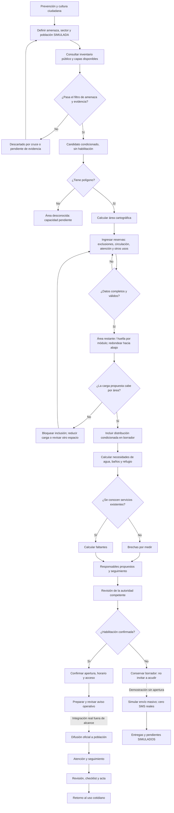

# Flujo detallado de Cali Activa

El video recorre este proceso en 80 segundos. Los rombos son decisiones; las flechas rojas detienen o devuelven la propuesta, y las verdes permiten continuar de manera condicionada.

## Ejemplo de acopio mostrado

- **Dato real:** área del polígono `epou-9465`, calculada con Turf: 447,2149007228903 m².
- **Supuestos SIMULADOS:** exclusiones 100 m², circulación 80 m², atención 60 m² y otros usos 40 m².
- **Resultado del supuesto:** 167,2149007228903 m² restantes.
- **Módulo SIMULADO:** 10 m² de huella. Máximo teórico: 16 módulos completos.
- Proponer 20 requiere 200 m²: excede en 32,79 m² y se bloquea su inclusión.
- Proponer 16 requiere 160 m²: deja 7,21 m² en el balance supuesto.

Las cifras visibles se redondean a dos decimales; el cálculo usa la precisión completa. No se afirma que los módulos encajen físicamente en el parque ni que este esté disponible. Resultados exportados de la misma función del frontend en `src/ejemplo-acopio.json`.
